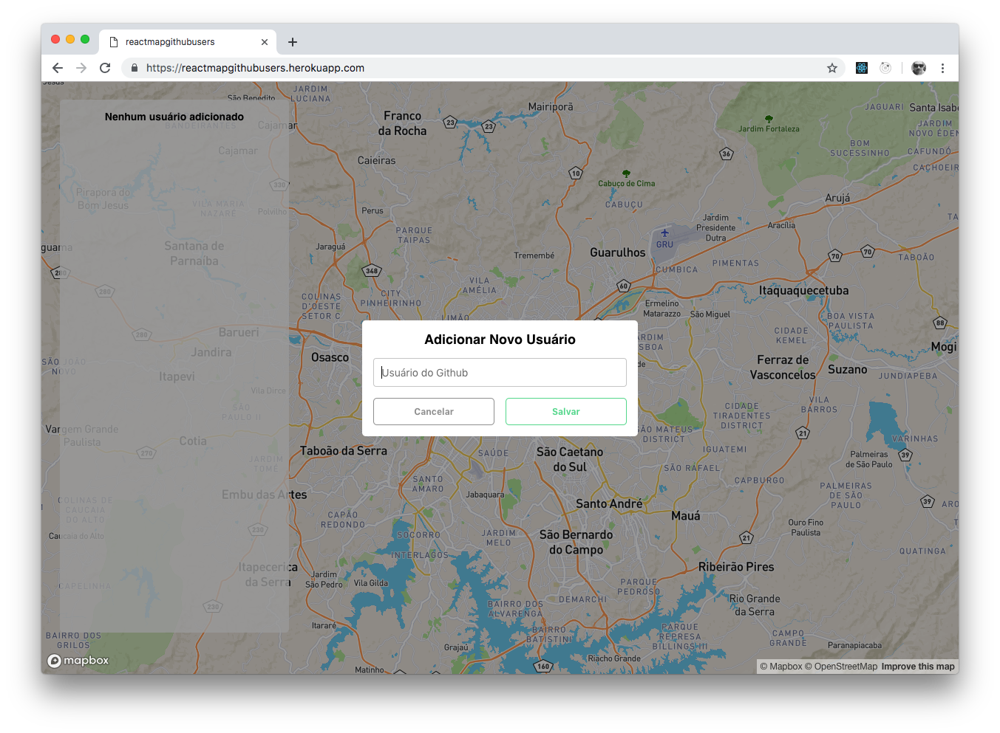
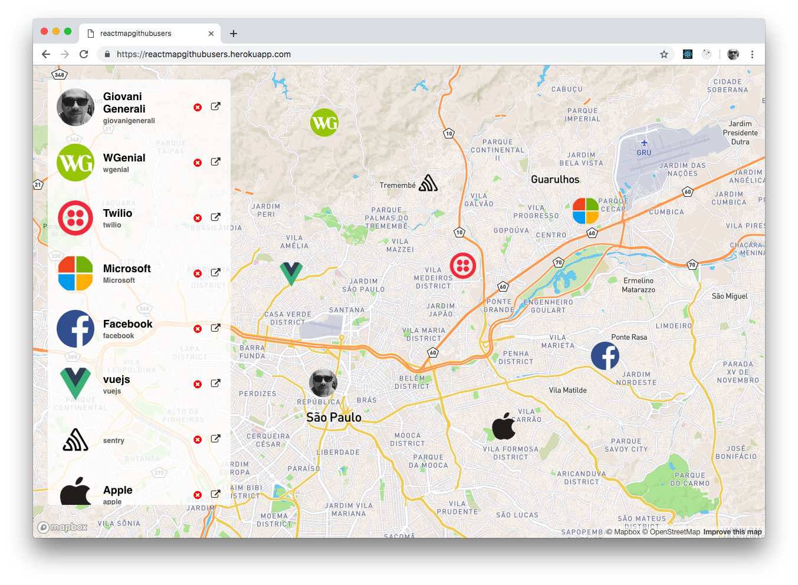

# React Map Github Users

Aplicação desenvolvida no Bootcamp da Rocketseat.

O conceito é ao clicar no mapa você pode digita um usuário do GitHub e em seguida será adicionado um marcador com a imagem do usuário e também na listagem lateral.

A aplicação utiliza tecnologias como ReactJS, Redux, Redux-Saga, React Map GL (wrapper para trabalhar com mapas do MapBox criado pelo Uber), etc... para mais info consulte o `package.json`

